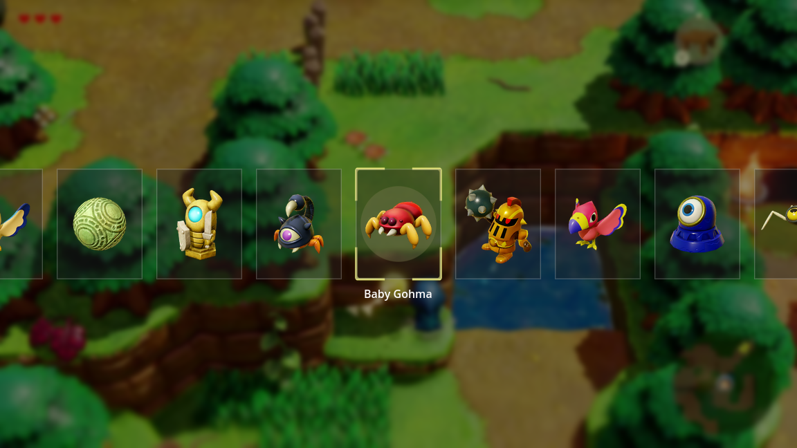
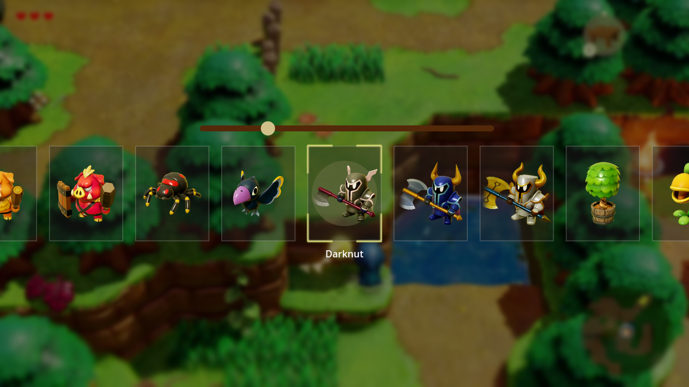
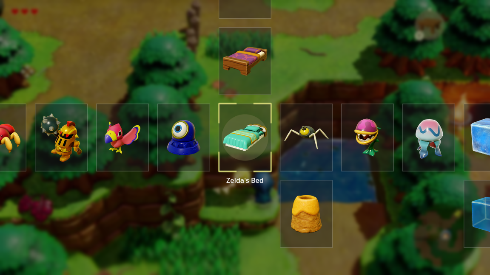
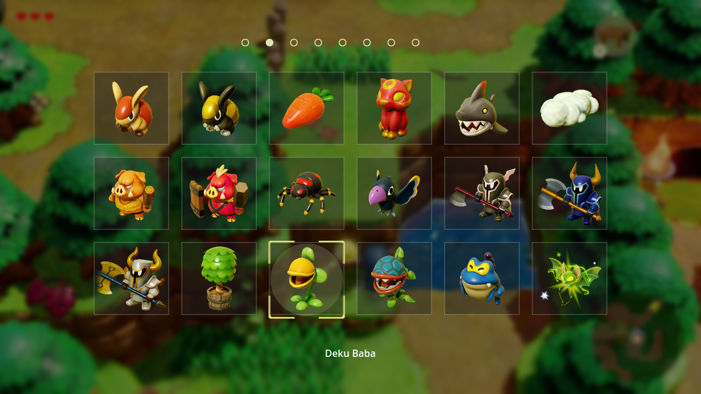
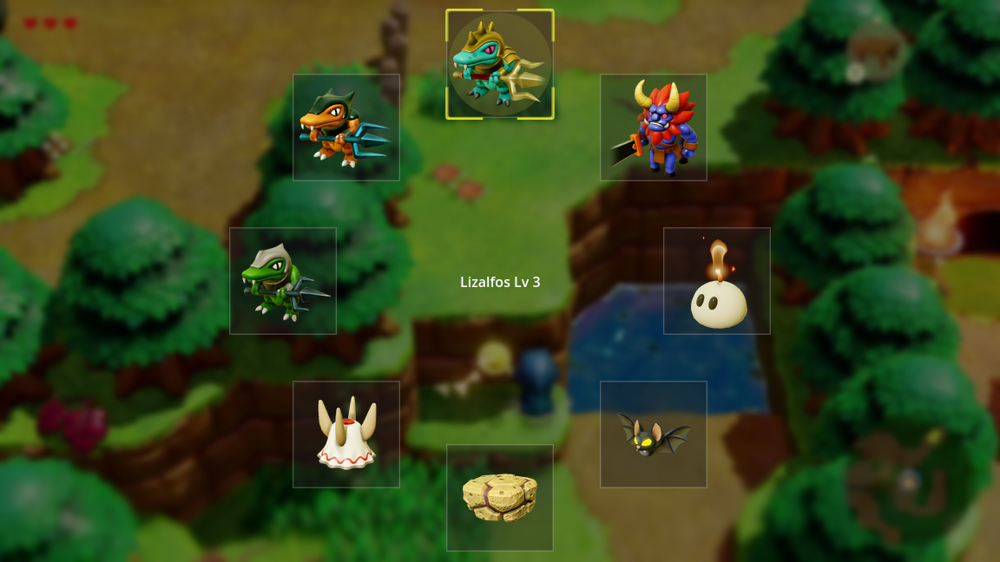
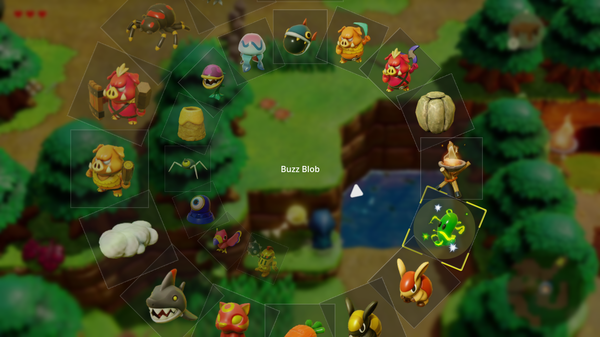

# 选择菜单
在 Godot4.4 中实现 GMTK 的视频 [Can I fix Zelda's UI using Unity?](https://www.youtube.com/watch?v=e4vsgC41bYgs) 中的各种选择菜单。

## 塞尔达：智慧的再现原版选择菜单

## 在原版上增加加速功能

## 跨媒体栏

## 经典的带标签的网格

## 径向菜单

## 螺旋菜单

## 资源
回声图片: https://zelda.fandom.com/wiki/Echo
切换音效: https://www.kenney.nl/assets/interface-sounds